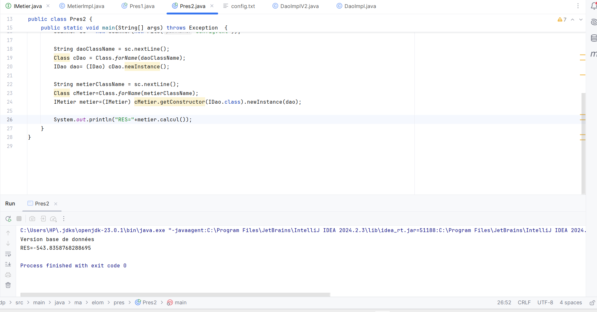
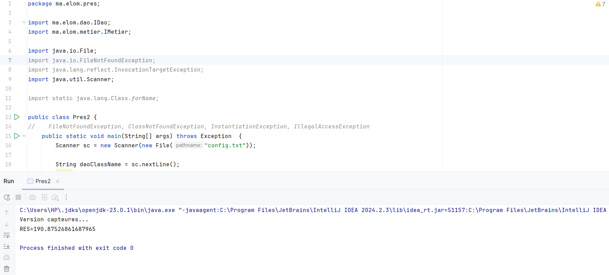
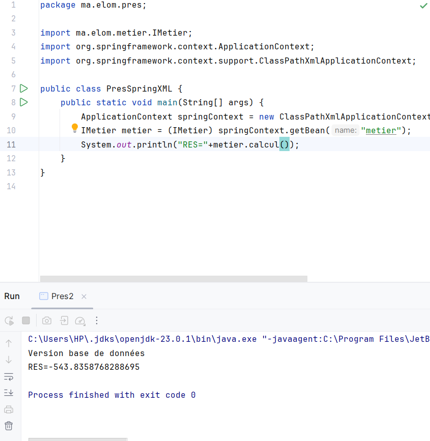
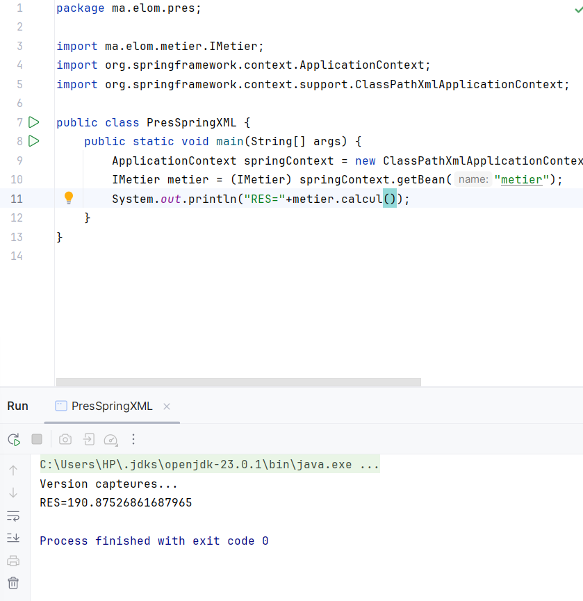
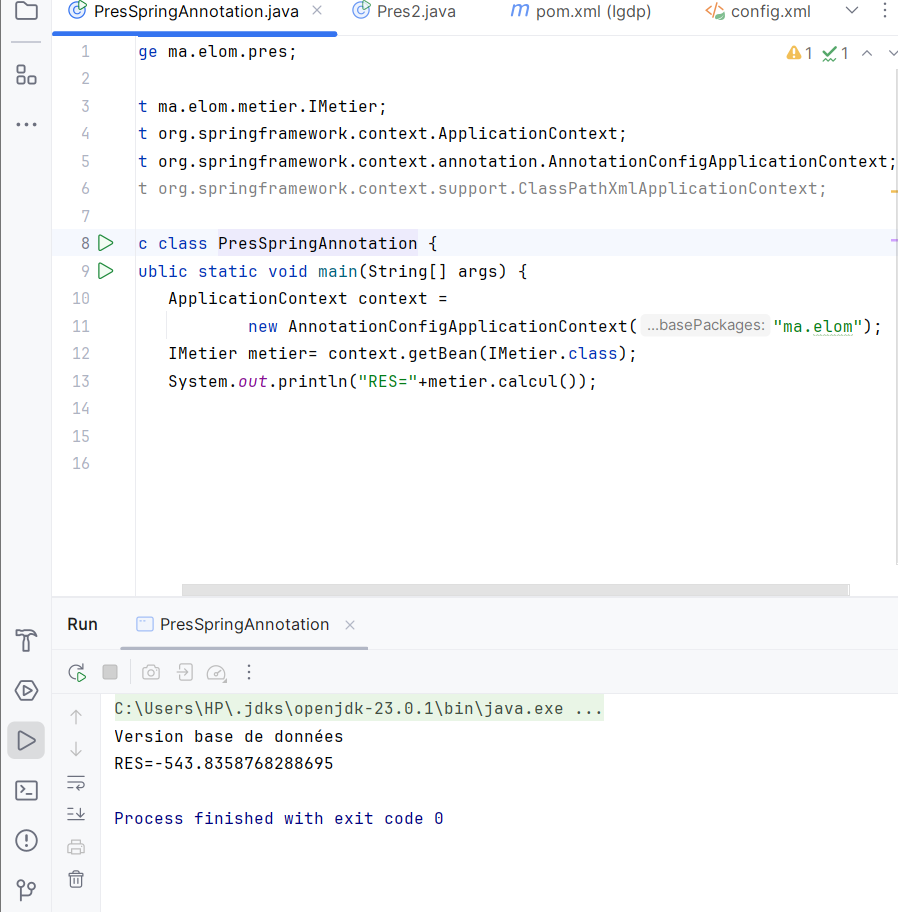
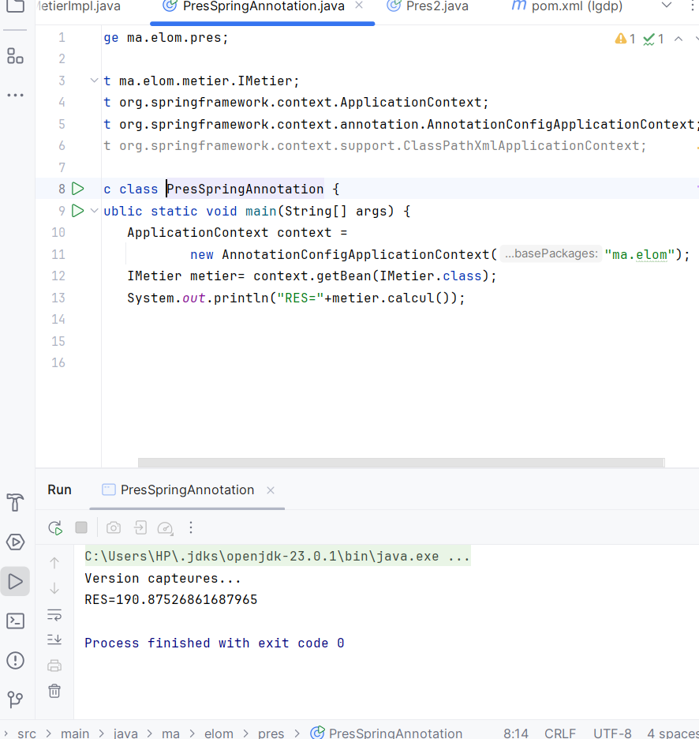

#   Injection des dépendances :

## **-Par instanciation statique**
version BD :

Version Cap:

## **-Version XML**
version BD :

Version Cap:

## **-Version annotations**
version BD :

Version Cap:

